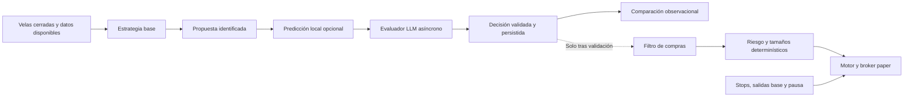

# Próxima etapa: estrategias de 1h, modelos predictivos y evaluación de un LLM

Fecha: 2026-09-17. Estado: **propuesta de implementación**, solicitada por el usuario. Este documento no activa estrategias, cambia los gates ni autoriza trading real. Parte del código en `a2991e9`, sobre `codex/paper-multiestrategia`.

## 1. Conclusión y decisión recomendada

El objetivo es encontrar una ventaja neta reproducible, comparando una opción moderada y otra más activa. La cantidad de operaciones se mide como resultado; no se fuerza a operar cuando no hay señal.

Los resultados propios tienen prioridad sobre la popularidad de un repositorio o de un modelo:

| Variante | Retorno neto OOS acumulado | DD OOS | Sharpe OOS | Cierres/mes |
|---|---:|---:|---:|---:|
| Referencia `regime_bh` | +90,65 % | 15,28 % | 1,04 | 0,71 |
| Retrocesos A | −9,42 % | 10,41 % | −1,44 | 11,02 |
| Retrocesos B | −24,83 % | 26,51 % | −1,56 | 14,46 |
| Donchian A | +6,81 % | 5,11 % | 0,61 | 3,40 |
| Donchian B | +36,29 % | 8,92 % | 1,01 | 4,44 |

Son 48 meses OOS, 2021-08-01 a 2025-08-01 exclusivo, con costos. Los retornos no son anuales ni comparaciones a igual volatilidad. Fuente y limitaciones: [informe registrado](../../experiments/candidates-2026-09-17/REPORT.md).

Decisiones:

1. Conservar la referencia y su historia. Sigue siendo paper; su buen OOS no subsana su holdout desfavorable/incompleto.
2. Archivar `pullback_rsi` v1 como resultado negativo. No ajustar sus umbrales buscando rescatarlo.
3. Mantener Donchian como control principal para investigar mejoras. B pasó las etapas anteriores al holdout incluso con costos adversos, pero **no tiene Gate 1 completo y sigue excluido de paper por el protocolo anterior**.
4. Investigar una familia nueva y pequeña: Supertrend, en 4h y 1h, para separar el cambio de regla del cambio de intervalo.
5. Probar primero un modelo supervisado local como filtro de las entradas Donchian. Comparar regresión logística y LightGBM con las mismas variables y datos.
6. Preparar un LLM como evaluador de propuestas. Empieza registrando decisiones sin enviar órdenes; solo pasa a filtrar compras paper si demuestra valor incremental y se resuelve el modelo de ejecución con latencia.
7. Postergar 1m/5m como intervalos de señal, nuevas familias de reversión, aprendizaje por refuerzo y entrenamiento de un LLM propio.

El filtro de un LLM normalmente **reduce** las entradas propuestas. La búsqueda de más actividad se hace con la investigación de 1h; la prueba de IA busca mejorar selección y rendimiento ajustado por riesgo. Son objetivos diferentes.

## 2. Uso de Freqtrade, FreqAI y elección de modelos

Freqtrade y su colección se revisaron en las revisiones `9f10e357a93c1dcf10c2a2b367659214d89c073e` y `f3340ce11f5bdf62f598522e64d1f5638eaa13f5`, respectivamente. La colección advierte que sus ejemplos requieren validación y no están listos para uso directo. [Colección oficial](https://github.com/freqtrade/freqtrade-strategies).

La estrategia Supertrend publicada combina tres indicadores de entrada y tres de salida, parámetros optimizados, ROI variable y un stop del 26,5 %. La propuesta de abajo será **una variante nueva y simplificada**, no una reproducción de sus resultados. No se le atribuirá la rentabilidad de un ejemplo externo. [Código inspeccionado](https://github.com/freqtrade/freqtrade-strategies/blob/f3340ce11f5bdf62f598522e64d1f5638eaa13f5/user_data/strategies/Supertrend.py).

FreqAI ofrece entrenamiento y reentrenamiento de modelos, predicciones históricas y persistencia de artefactos dentro de Freqtrade. Tiene soporte para LightGBM/XGBoost; su ejemplo no está destinado a producción. Es una referencia útil para implementar el ciclo del modelo. [Introducción](https://www.freqtrade.io/en/stable/freqai/), [configuración](https://www.freqtrade.io/en/stable/freqai-configuration/), [ejecución](https://www.freqtrade.io/en/stable/freqai-running/).

**No migrar el bot operativo ni incorporar dos motores para aprobar estrategias.** Se usarán LightGBM y scikit-learn directamente detrás de interfaces propias; FreqAI no es un componente intercambiable con el `Engine` actual. Un entorno aislado de Freqtrade puede servir para verificar indicadores y ejemplos, pero la comparación financiera decisiva se hará en nuestro motor, con sus costos y contabilidad. Freqtrade asume fills sin slippage en su backtest; su resultado bruto no es intercambiable con el nuestro. [Supuestos oficiales](https://www.freqtrade.io/en/stable/backtesting/#assumptions-made-by-backtesting).

El proveedor LLM será intercambiable. No se elige Jev, Claude, GPT o un modelo financiero por nombre. Antes de contratar llamadas de mercado se hará una prueba de contrato con un máximo de dos modelos disponibles: JSON válido, errores, costo medido y latencia sobre casos sintéticos. Se elegirá uno con reglas fijadas de antemano y se congelará su identificador/versionado. No se seleccionará el proveedor mirando PnL histórico. Kronos u otro modelo preentrenado de series temporales queda como experimento posterior: también necesita esclarecer procedencia de datos y contaminación temporal.

## 3. Alcance, rama y documentación

- Implementación propuesta en `codex/research-ml-llm`, desde una base que incluya `a2991e9`. Si esos cambios ya se integraron a `main`, partir de ese `main`; si no, partir de la rama actual. No perder la infraestructura y documentación ya entregadas.
- Este plan se guarda en la rama actual. No crea la rama de desarrollo ni hace commit por sí mismo.
- Antes de código: especificaciones de `supertrend` y `ml_filter`, protocolo de investigación, y ADRs para predicciones externas, ejecución diferida y gates aplicables a modelos que se reentrenan.
- Actualizar la Fase 9 del roadmap: la carpeta `analyst/` anunciada aún no está implementada. La referencia a un SDK/modelo en el roadmap no equivale a una integración existente.
- Mantener revisión de código antes de cerrar cambios en estrategia, indicadores, riesgo, ejecución o motor. La sesión principal es el único escritor, conforme a `CLAUDE.md`.
- Un cambio de gates requiere decisión documentada previa a la evaluación correspondiente. Este plan no convierte resultados `n/a` en aprobados.

## 4. Matriz de experimentos acotada

Universo fijo: BTC, ETH, BNB, XRP, ADA, LTC, LINK y SOL contra USDT, Binance Spot, solo long. Incorporar cada activo a partir de sus datos disponibles y warmup. Declarar el sesgo de usar un universo elegido hoy.

| Identificador conceptual | Señal | Intervalo | Perfiles | Propósito |
|---|---|---|---|---|
| R | Referencia actual | 4h | Original | Control operativo e histórico |
| D4 | Donchian v1 ya implementado | 4h | A y B | Controles congelados |
| S4 | Supertrend simple v1 | 4h | A y B | Comparar regla con D4 |
| S1 | Mismo Supertrend v1 | 1h | A y B | Evaluar intervalo más corto |
| D4-LR | D4 + filtro de regresión logística | 4h | A y B | Control sencillo del aprendizaje |
| D4-GB | D4 + filtro LightGBM | 4h | A y B | Valor incremental de un modelo más flexible |

Son ocho configuraciones históricas nuevas, más controles existentes; las repeticiones por costos y sensibilidad se registran, no cuentan como descubrimientos independientes. No agregar familias al ver una curva adversa.

S1 y S4 conservan los períodos en velas: cambia también su horizonte en horas. Por ello se mide el efecto de esta versión de la estrategia al cambiar de intervalo, no un efecto puro de frecuencia manteniendo idéntico horizonte. Una variante con períodos reescalados sería otra hipótesis, fuera del lote inicial.

El LLM se estudia después, sobre **una base congelada** elegida por la jerarquía predefinida: pasar gates, robustez a costos y mejora respecto de su control. Empates: menor complejidad, menor DD y luego identificador alfabético. Si ninguna base es elegible, continúa solo el registro de señales y predicciones, sin crear un paper candidato por conveniencia.

### Riesgo y costos

Conservar A y B: capital de 10.000 USDT, riesgo por stop 0,25 % / 0,50 %, dos/tres posiciones, exposición máxima de entrada 50 % / 75 %, límite diario 3 %, breaker 20 % y pausa de 30 días. El tope actual por posición se calcula sobre cash disponible ajustado por costos; no renombrarlo como 25 % de equity. Documentar la reanudación manual/automática efectiva de cada modo.

Comisión: 0,10 % por lado. Slippage: 5, 10 y 20 bps por lado. Costos orientativos de ida y vuelta: 0,30 %, 0,40 % y 0,60 %, antes de otros efectos. No modificar tarifas para rescatar resultados. Riesgo y costos de API se reportan por separado.

A es candidato a paper si supera todo. B sigue histórico/observacional en este alcance. Si se decide promover B en el futuro, hará falta un protocolo nuevo y explícito, con validación final y prospectiva; no se declarará que el protocolo original lo había aprobado.

## 5. Estrategia Supertrend v1

Especificar e implementar una sola línea Supertrend con ATR de Wilder(10), multiplicador 3, bandas sobre `(high + low) / 2`, continuidad de bandas y cambio de dirección usando únicamente cierres. Documentar exactamente semilla, primera dirección válida, igualdades y continuidad de estado antes del código.

- Entrada: cambio de dirección bajista a alcista en vela cerrada, sin posición y con volumen positivo.
- Salida: dirección bajista, aunque no sea la primera vela bajista. Esto permite recuperar una salida tras reiniciar.
- Stop inicial y trailing: 3 ATR(14), usando el mecanismo ya existente. Una actualización de trailing nunca baja el stop.
- Filtro de entrada: BTC diario sobre SMA200 y retorno de 30 días positivo; bloquear cuando no haya datos suficientes. El filtro no provoca ni impide ventas.
- Ranking: distancia positiva entre cierre y línea Supertrend dividida por ATR(14); empate por símbolo. Es fuerza de señal, **no probabilidad**.
- Sin objetivos ROI por tiempo, promediar a la baja, apalancamiento ni optimización masiva.
- Señal en `t`, ejecución al open de `t+1` bajo el contrato actual.
- Meseta: ±20 % del período ATR del indicador, su multiplicador y el multiplicador del stop, uno por vez y vértices, con cuantización explícita. No elegir el mejor vecino luego.

Warmup: al menos el del filtro diario y el necesario para la equivalencia del indicador recursivo. Si ampliar una ventana finita no da señales equivalentes, persistir/reproducir el estado recursivo correctamente; no aumentar tolerancias para ocultarlo.

## 6. Modelo supervisado y significado de «confianza»

Primera función: aceptar o rechazar una entrada que Donchian ya propuso. El modelo no cambia tamaños, stops, prioridades ni salidas. Se comparten predicciones entre A y B, pero cada cartera se simula independientemente.

### Datos y objetivo

- Variables limitadas y versionadas: retornos de 1/3/6/18 velas, RSI(14), ATR(14)/precio, ADX(14), distancia a EMA200 y al canal en ATR, volumen relativo, retornos de BTC y estado diario de BTC. Las variables diarias solo aparecen una vez cerrado el día UTC.
- Entrenar un modelo común a los pares, con identificación del par codificada por una regla fija y tratamiento explícito de activos nuevos. No elegir pares por su rentabilidad posterior.
- Objetivo binario: si una compra hipotética en el open siguiente tendría retorno neto positivo al open situado 24 horas después, descontando los costos base. Guardar inicio y final temporal de cada etiqueta. No incluye una promesa sobre la salida final de Donchian.
- Generar etiquetas para las velas elegibles del universo; evaluar calibración también sobre las entradas candidatas Donchian. Las muestras se solapan y no se tratarán como operaciones independientes.
- No rellenar precios futuros ni atravesar huecos de datos como si fueran observaciones reales. Separar columnas de variables y etiquetas en contratos distintos.

`p_positive_net_24h=0.60` significa una estimación del evento definido arriba. No significa «60 % de probabilidad de que este trade Donchian gane» ni una expectativa neta positiva de esa cartera. Un `strength` de la estrategia o una confianza declarada por un LLM tampoco son probabilidades calibradas.

### Entrenamiento y ejecución

- Regresión logística como control; LightGBM como candidata. Hiperparámetros modestos y fijos en el primer lote, semilla registrada, sin Optuna inicialmente.
- Historia móvil de 24 meses, usando 21 para ajuste y los últimos 3 para calibración sigmoide; OOS exterior de 6 meses. Reentrenamiento mensual con la misma receta, siempre con información disponible entonces.
- Separar por fechas, simultáneamente para todos los pares. Excluir etiquetas cuyo desenlace llegue al tramo siguiente o al instante de entrenamiento. No usar validación aleatoria ni el calibrador sobre ejemplos empleados para ajustar ese mismo modelo.
- Umbral inicial congelado: aceptar cuando `p_positive_net_24h >= 0.55`; conservar ranking Donchian. Rechazar entradas ante modelo vencido, datos inválidos o predicción ausente. Las salidas siguen.
- Sensibilidad del umbral ±20 % como diagnóstico, sin elegir retrospectivamente el umbral ganador. La robustez del modelo también incluye semillas, ventanas y reducción de variables, definidas antes de ejecutar el lote; no presentarlas como una meseta idéntica a la de una regla técnica.
- Artefacto con pesos, calibrador, lista/orden de variables, versiones, semilla, hashes, rango de entrenamiento, instante de disponibilidad y vencimiento. Cargar solo artefactos producidos por nuestro entrenamiento.
- Entrenar en la Mac; el VPS solo infiere con un artefacto aprobado. Un nuevo entrenamiento se valida y publica de manera atómica. Si falta un modelo válido, la candidata bloquea compras sin detener ventas.
- La inferencia no puede usar un modelo entrenado después del evento histórico. Registrar predicciones históricas para replay, sin reentrenar durante el replay.

La calibración se examina con curvas de fiabilidad y tamaño de muestra, además de Brier/log-loss; un buen score aislado no demuestra rentabilidad ni calibración perfecta. [Documentación de calibración](https://scikit-learn.org/stable/modules/calibration.html). La separación temporal necesita además purgar etiquetas que cruzan fronteras; un `gap` por filas no resuelve por sí solo un panel de monedas con etiquetas solapadas. [TimeSeriesSplit](https://scikit-learn.org/stable/modules/generated/sklearn.model_selection.TimeSeriesSplit.html).

El validador actual exige reglas fijas y resultados por regímenes desde 2020. Se documentará que la **receta** de reentrenamiento permanece fija aunque cambien los pesos, y se ampliará el runner de forma explícita. Obtener historia anterior suficiente donde sea necesario. Si no puede evaluarse un régimen requerido con entrenamiento válido, el gate queda incompleto; no puntuar como éxito meses sin un modelo entrenado.

## 7. LLM sobre propuestas del algoritmo

### Flujo y alcance de la primera versión

El LLM recibe una propuesta, las variables disponibles, posición/cash/riesgo, costos estimados y, cuando exista, una predicción calibrada con su evento y horizonte. No se le pide inventar una probabilidad para sustituir la del modelo.

Respuesta estructurada: `BUY | SELL | HOLD | ABSTAIN`, `proposal_id`, `snapshot_hash`, `reason_code` y una explicación corta. El propio sistema fija timestamps, vencimiento y versión; no confía en los que pueda inventar el modelo. Sin campos de cantidad, apalancamiento o cambios de stop.

- Sin posición: `BUY` puede aceptar la compra candidata; `HOLD`/`ABSTAIN` la descartan; `SELL` es inválido.
- Con posición: registrar `SELL`/`HOLD` para estudiar salidas. En v1 son recomendaciones; las salidas ejecutables siguen siendo las de la estrategia y sus protecciones.
- El LLM no crea compras fuera del universo de propuestas, no aumenta riesgo y no veta stops, salidas base ni un cierre solicitado por el usuario.
- Promover salidas anticipadas del LLM exigiría otra versión y otra comparación. No mezclar cambios de entrada y salida en el primer experimento.
- Primera versión sin navegación web ni herramientas con capacidad de ejecutar órdenes. Noticias y contexto textual quedan para una segunda hipótesis, con fuente, `published_at` y `received_at`, deduplicación y pruebas frente a instrucciones maliciosas en contenido externo.

La evaluación inicial es observacional: decisiones registradas en tiempo real, sin fills ni capital ficticio inventados para simular una aprobación. Un backtest consultando hoy a un LLM sobre fechas antiguas sirve para depurar el formato, **no** como evidencia principal: el modelo podría conocer acontecimientos posteriores, aunque se omitan las fechas.

### Contrato temporal: resolverlo antes de un paper con LLM

El `PaperBroker` actual puede completar una orden usando el open de la vela en formación. Después de esperar una respuesta externa, atribuir ese precio a una decisión posterior produciría una comparación optimista. Esta limitación debe corregirse para la candidata con LLM antes de activarla.

Diseño propuesto para ese experimento, mediante ADR y política compartida de ejecución:

1. Cerrar y congelar el snapshot en `signal_ts`, definido aquí como el cierre UTC exclusivo de la vela; registrar cuándo llegó realmente al proceso. Mapear explícitamente ese campo al dominio actual, sin confundirlo con el timestamp de apertura de una vela.
2. Límite global de decisión en `signal_ts + 45 s`, incluyendo cola/reintentos. Snapshot tardío o respuesta posterior: entrada expirada.
3. Ejecución elegible desde `signal_ts + 60 s`. En replay usar el primer open de 1 minuto elegible posterior a la decisión; en paper usar una cotización fresca posterior a la elegibilidad y registrar el timestamp real. No reclamar un precio anterior si el proceso llegó tarde.
4. Vencimiento definitivo de la propuesta a los 120 s del cierre. Si no hubo precio válido/ejecución, cancelar; nunca recuperar una entrada vieja al reiniciar.
5. Mismas reglas de espera y expiración en los controles de la comparación con LLM. Las salidas protectoras no esperan la consulta.
6. Registrar precios y latencia para medir la diferencia entre el modelo de replay y el paper; repetir sensibilidad a demora y costos. Sin datos de 1 minuto suficientes, la evaluación de ejecución queda incompleta.

Las velas de 1 minuto aquí son **datos para ejecutar/evaluar una señal de 1h/4h**, no una estrategia de scalping. La política de espera debe existir en el camino común del motor/brokers, con defaults anteriores para la referencia; no agregar un atajo exclusivo del backtest.

### Errores, costos y reproducibilidad

- Worker separado del camino de stops; cola acotada, concurrencia limitada y reintentos que respeten el plazo absoluto.
- Timeout, 429, JSON inválido, IDs distintos, respuesta duplicada o vencida: no comprar. Las posiciones existentes mantienen sus protecciones.
- Clave de idempotencia: instancia + símbolo + cierre + familia + versión de política. Persistir propuesta antes de llamar y decisión antes de crear una intención de orden. Vínculo único decisión/orden; recuperación transaccional tras caídas.
- Cachear por hash completo de snapshot, prompt y modelo. No repetir una llamada para elegir una respuesta más favorable. Un replay consume decisiones guardadas, nunca la API.
- Congelar prompt, parámetros, modelo y proveedor. Temperatura baja no garantiza determinismo; se conserva la respuesta efectiva y su huella.
- Tope de diseño propuesto: USD 20/mes y USD 1/día de API, configurable y con corte automático. Son límites de gasto, no precios del proveedor ni consumo autorizado por este documento. El costo de API es real aunque el capital de trading sea ficticio.
- Reservar presupuesto antes de cada llamada y descontar uso real después. Registrar tokens, costo, tiempos, error, expiración y disponibilidad del modelo. Verificar tarifas vigentes en la selección del proveedor.
- Usar solo datos necesarios: nunca enviar claves de exchange, token Telegram, `.env`, contraseñas o archivos arbitrarios.

## 8. Comparaciones que permiten atribuir una mejora

Para cada prueba IA se necesita el mismo universo, presupuesto de riesgo, intervalo, costos y ejecución:

- Base sin filtro.
- Base + regresión logística.
- Base + LightGBM.
- En la etapa LLM: base elegida con igual espera, base + regla sencilla de filtrado/riesgo y base + LLM. Si se evalúa una combinación ML+LLM, conservar también ML solo.

Comparar primero señales idénticas y recomendaciones; después carteras completas e independientes. Tras un veto las carteras divergen: no multiplicar el PnL de trades rechazados ni suponer que las posiciones y el cash posteriores serían iguales.

Añadir un control con menor exposición fijada usando exclusivamente el tramo de entrenamiento. Así se distingue selección útil de simplemente invertir menos. Si se usa retención aleatoria de señales como diagnóstico, congelar semillas y tasa según entrenamiento; nunca elegir una semilla ganadora.

Reportar retorno neto, Sharpe, DD, PF, volatilidad, tiempo invertido, exposición monetaria, operaciones/mes, meses inactivos, duración, costo por operación y total, tiempo bajo el máximo y concentración por moneda/año. Mostrar por separado resultado tras costos de trading y resultado tras el costo de API convertido con una política de valoración registrada.

No llamar «confianza estadística» a la explicación convincente del LLM. La comparación usa diferencias de retornos diarios emparejados y remuestreo por bloques temporales, conservando la correlación entre activos. Guardar todas las variantes probadas y no presentar múltiples intentos como una sola hipótesis.

## 9. Datos, validación y criterios de avance

### Preparación

- Python 3.12 y dependencias gestionadas con uv; ML en grupo opcional. Registrar lockfile, plataforma y versiones.
- Verificar datos 4h/1h de los ocho pares y datos diarios derivados de días completos. Conservar hashes y huecos reales; comprobar exclusión de velas abiertas y activos antes de su listado.
- Descargar 1m solo para los rangos necesarios de ejecución diferida; estimar espacio y tiempo antes de una descarga histórica grande. Reutilizar datos públicos sin credenciales de trading.
- La investigación pesada y el entrenamiento van en la Mac. No competir con el proceso operativo del VPS.

### Validación histórica

- Para reglas: backtest continuo y walk-forward 24m/6m, todos registrados por CLI. Reutilizar controles cuando coincidan exactamente código, datos, fechas y costos; repetirlos si alguno cambia.
- Para ML: ventanas exteriores iguales, receta de reentrenamiento fija, calibración temporal y purga por timestamps; reportar también períodos sin modelo válido.
- Para reglas y modelos locales, aplicar íntegros los umbrales actuales de [GATES.md](../GATES.md): Sharpe OOS ≥0,8 y ≥ B&H BTC; PF ≥1,3; DD ≤25 % y ≤ mitad del DD B&H; ≥60 % de ventanas positivas; ≥100 trades en muestra completa y ≥40 OOS; regímenes por año; meseta ≥80 %; Monte Carlo de 5.000 remuestreos con DD p95 ≤35 %; equivalencia y holdout. No omitir criterios cuando falten datos.
- Costos adversos a 10/20 bps por lado, sin reajustes. Para esta etapa se exige mantener Gate 1 pre-holdout también a 20 bps antes de recomendar una candidata.
- Añadir bootstrap por bloques de retornos para dependencia temporal; no reemplaza el Monte Carlo obligatorio de trades.
- Umbral de objetivo de actividad propuesto para S1: ≥2 cierres/mes OOS y actividad en ≥50 % de meses. Si pasa rentabilidad pero no actividad, clasificarlo como alternativa de baja frecuencia; no anunciar resuelto el objetivo de mayor actividad.

### Valor incremental de IA: criterio propuesto a congelar antes de probar

Además de gates absolutos, exigir una de estas dos mejoras respecto del control con igual ejecución y riesgo: (a) Sharpe +0,10 o más, con DD no más de 2 puntos porcentuales peor; o (b) DD relativo al menos 20 % menor, conservando al menos 90 % del retorno acumulado positivo del control. En ambos casos evaluar costos de API cuando corresponda, dependencia de pares/regímenes, y que el control de menor exposición no explique por completo la mejora.

Son márgenes de decisión del nuevo protocolo, no leyes estadísticas ni criterios ya implementados. Intervalos de incertidumbre amplios o pocos eventos llevan a **inconcluso**, aunque la estimación puntual cumpla. En la evaluación final de promoción, pedir respaldo de un intervalo del 95 % por bloques para la mejora primaria preseleccionada; no elegir después cuál de los dos objetivos declarar principal. Usar las alternativas históricas para selección, no como confirmación independiente.

### Holdout y evaluación futura

El período desde 2025-09-01 ya fue observado para otras estrategias. Llevar un registro explícito de familias/fechas consultadas y evaluar una sola vez la configuración A final de cada familia que pase las etapas previas. No presentarlo como un conjunto completamente virgen; no extenderlo repetidamente esperando que una posición o un PF se vuelvan favorables.

Los LLM preentrenados necesitan evidencia prospectiva. Congelar modelo/prompt/política antes de comenzar a recolectarla. Mínimo de observación financiera propuesto: 12 semanas y 40 operaciones cerradas en cada cartera que se pretenda comparar; además, suficientes propuestas aceptadas y rechazadas para medir el filtro. A la frecuencia actual esto puede tardar muchos meses. Revisar salud durante ese plazo, pero decidir eficacia en el corte previamente fijado; si falta muestra, declarar inconcluso y documentar cualquier extensión antes de mirar el siguiente resultado.

Las 8 semanas de Gate 2 siguen siendo un mínimo operativo, no una prueba automática de rentabilidad. Este proyecto no incluye habilitar live.

### Condición específica para un paper experimental con filtro LLM

El Gate 1 vigente no define cómo habilitar un filtro preentrenado validado únicamente hacia adelante. No se le puede atribuir un walk-forward histórico limpio por haber consultado fechas pasadas. La implementación deberá proponer y registrar **antes de la evaluación prospectiva** un ADR y un gate específico para esta etapa experimental, sin marcar aprobado el Gate 1 convencional del LLM.

La propuesta es exigir simultáneamente: base con Gate 1 completo en la misma política de ejecución diferida; perfil A; observaciones prospectivas congeladas con el mínimo de 12 semanas/40 cierres por cartera; replay de esas decisiones con precios disponibles después de decidir; PF prospectivo ≥1,3, DD ≤25 % y retorno positivo después de API; mejora incremental e incertidumbre según el objetivo elegido antes de evaluar; equivalencia/recuperación y costos adversos satisfactorios. Registrar también Sharpe, benchmark, regímenes observados y todo lo que aún no puede evaluarse con esa muestra. La muestra prospectiva es evidencia para ese experimento paper, no reemplaza años de regímenes distintos ni habilita dinero real.

Si no se adopta previamente ese protocolo o no se cumplen sus condiciones, el entregable LLM permanece observacional. No se crea una excepción después de mirar un resultado atractivo ni se presenta una comparación de 12 semanas como equivalente al Gate 1 histórico.

## 10. Cambios de código y contratos

Rutas propuestas; aún no implementadas:

| Área | Cambio |
|---|---|
| `indicators/` y `strategy/strategies/supertrend.py` | Indicador, semilla/estado, regla, registro y parámetros |
| `features/` | Snapshot común y determinístico para entrenamiento, replay e inferencia |
| `research/` | Generación de etiquetas, separación temporal, ajuste/calibración y artefactos |
| `prediction/` | Protocol `Predictor`, carga de modelo, predicción versionada y vencimiento |
| `decision/` | Propuestas, decisiones, validador de acciones, filtro puro y proveedor replay |
| `analyst/` | Cliente LLM, worker asíncrono, presupuesto y salida estructurada; sin broker |
| `engine/` | Consumir decisiones disponibles mediante un puerto inyectado; defaults sin IA |
| `execution/` | Política opt-in de disponibilidad/expiración y replay con detalle de 1m |
| `persistence/` | Tablas aditivas de propuestas, predicciones, decisiones y consumo; recuperación |
| `validation/` | Walk-forward de modelos, métricas de calibración/incrementales y paridad |
| `config/`, `cli/`, `notify/` | Configuración, comandos de investigación, identidad y resúmenes |

No hacer llamadas HTTP dentro de `Strategy.on_candle`; sigue siendo determinística. Inferencia y decisiones externas se convierten en entradas temporales versionadas del motor. El modo sin IA tiene que conservar sus resultados previos.

La regla actual de limitar `float64` a indicadores necesita una excepción documentada para variables/pesos de ML. Precios, cash, cantidades, fees y contabilidad continúan en `Decimal`, con conversión explícita en los bordes. Ningún modelo calcula el tamaño final de orden.

Registros mínimos: `proposal_id`, instancia, símbolo, estrategia/política, `signal_ts`, `observed_at`, `available_at`, `expires_at`, hashes de datos/features/modelo/prompt, acción, motivo, validez, costo y referencia de orden/fill. Separar la recomendación de la ejecución y enlazarlas, para no confundir un `BUY` propuesto con una compra hecha.

CLI propuesta: `research dataset`, `research train`, `research predict`, `research compare`, `advisor observe`, `advisor replay` y `advisor status`. Registrar artefactos bajo el sistema de experimentos existente; estos comandos son entregables futuros, no instrucciones ejecutables hoy.

## 11. Tests y revisión

- Supertrend: referencias independientes, cambios de dirección, empates, gaps, warmup, reinicio y equivalencia serie completa/ventana; alterar velas futuras no cambia decisiones previas.
- Variables: igualdad entrenamiento/inferencia; datos diarios no disponibles antes de cierre; ausencia de columnas futuras; normalización y calibración ajustadas solo con pasado.
- Modelos: etiqueta con horizonte/costos correctos, purga entre pares y ventanas, artefacto futuro/vencido rechazado, reproducibilidad con versiones/semillas fijas.
- Decisiones: schema estricto, acción incompatible con posición, IDs/hash incorrectos, duplicate, TTL, timeout, rate limit, presupuesto concurrente, reinicio en cada frontera transaccional.
- Motor: sin IA reproduce los resultados previos; filtro solo altera entradas; stops/salidas/STOP siguen funcionando con worker caído o saturado.
- Ejecución: ningún fill anterior a disponibilidad, precio viejo rechazado, orden vencida no renace, reloj del exchange, gaps/datos 1m ausentes, misma política en replay y paper.
- Aislamiento: DB, saldos, decisiones y controles independientes; Telegram con varios emisores y un receptor; outbox mantiene atomicidad con fills.
- Contratos del proveedor con dobles/mocks; smoke test de red explícito y limitado. No usar tests automáticos para disparar muchas llamadas pagas.
- `pytest`, Ruff/formato y mypy completos; revisión técnica exigida por el repositorio. No desplegar con fallos pendientes ni modificar tolerancias para hacer pasar paridad.

## 12. Paper, Telegram y recuperación

Reutilizar Compose separado y el outbox ya implementado. Máximo tres papers ejecutores: referencia y hasta dos candidatas aprobadas. Un observador de decisiones no tiene cuenta ni llena operaciones; sus recomendaciones se identifican como observación.

Si se aprueba una prueba LLM, reservar dos lugares para la base con la misma espera y la versión filtrada. No intentar correr todas las familias a la vez. Si el control o la variante no cumple las condiciones de paper, mantener la etapa observacional.

Cada candidata: 10.000 USDT ficticios, config/SQLite/logs/status/STOP/RESUME propios, imagen por revisión, artefacto de modelo por hash y límites de recursos. No sumar los saldos independientes como una sola cuenta. Comparación desde inicio común; informar la posición heredada de la referencia.

Telegram conserva un único receptor. Enviar operaciones ejecutadas con `[PAPER][instancia][estrategia/perfil]`, motivo de salida, resultado neto y hora argentina. Las recomendaciones LLM no se presentan como fills. Resumen diario opcional: propuestas, aceptadas/rechazadas, expiradas, errores y gasto; evitar mensajes por cada rechazo rutinario.

Antes de activar una candidata: backup consistente, migraciones aditivas verificadas, prueba de recuperación con copia, salud y consumo del conjunto en VPS, prueba Telegram marcada como prueba sin crear trades. Entrenamiento sigue fuera del VPS.

Rollback: detener compras de la candidata y conservar salidas/protecciones de posiciones abiertas; registrar la política de cierre o gestión con la versión actual. No cambiar a ciegas de modelo/estrategia con posiciones abiertas. Guardar imagen, artefactos y DB previos. Desactivar el worker LLM no debe detener el paper base ni su Telegram.

## 13. Orden de implementación y entregas

1. **Protocolo y datos.** Rama/base, specs y ADRs propuestos, inventario de exposición al holdout, matriz/configs congeladas, verificación 1h/4h y diagnóstico de ejecución temporal. Entrega: protocolo reproducible y tests de contrato.
2. **Supertrend y evaluación tradicional.** Indicador/regla compartidos, tests, cuatro configuraciones iniciales (S4/S1 × A/B), tres niveles de costos por configuración, sensibilidad y reportes por CLI. Entrega: resultados completos, incluso si todos fallan.
3. **Modelo local.** Variables/etiquetas, logística/LightGBM, calibración, artefactos y replay; evaluación A/B y controles de exposición. Entrega: informe de aporte incremental y límites de muestra.
4. **Evaluador LLM observacional.** Contratos, proveedor elegido por costo/latencia/formato, persistencia, presupuesto, replay y telemetría. Puede comenzar a recolectar decisiones una vez fijados sus inputs y protocolo; no necesita esperar una migración del bot ni un cambio del control.
5. **Validación final de reglas/modelos locales.** Revisión técnica, gates, evaluación final de holdout elegible una vez por familia y congelamiento de candidatas. Las aprobadas A pueden iniciar paper aislado. Si ninguna pasa, cerrar con no-go y conservar solo la referencia y el registro observacional.
6. **Ejecución diferida y eventual paper LLM.** Implementar/verificar la política temporal y replay financiero de las decisiones observadas antes de evaluar el gate LLM propuesto; retestar la base con igual demora. Solo tras cumplir ese protocolo, rollout del par control/LLM con runbook y rollback. Esta infraestructura puede desarrollarse mientras se recolectan observaciones, pero el paso a paper depende de la evidencia futura.
7. **Evaluación prospectiva.** Seguimiento operativo, corte de muestra predefinido, reporte financiero con incertidumbre y costos de API; decidir mantener, descartar o registrar una hipótesis nueva. No habilitar live en esta etapa.

No hay que completar ML, LLM ni esperar meses para conocer el resultado de Supertrend. Cada entrega aporta una decisión útil y puede detener la siguiente inversión de trabajo si la evidencia no la justifica. La duración de los backtests depende de los datos/equipo; la duración mínima prospectiva es tiempo de mercado y no se acelera generando operaciones artificiales.

## 14. Qué se considera terminado

Código revisado y probado, protocolos y fuentes versionados, comandos reproducibles, resultados de todas las variantes, decisiones go/no-go/inconcluso, configuraciones inactivas para las rechazadas y runbooks por instancia. Para las aprobadas que se activen: recuperación, aislamiento y avisos verificados.

Es un resultado válido conservar el algoritmo solo si ML o LLM no mejoran su control. También es válido concluir que 1h no compensa sus costos. La entrega no depende de terminar con tres bots ni de que una IA tome decisiones ejecutables.

Este documento se basa en resultados históricos existentes, revisión de código y documentación externa. **No se ejecutaron nuevos backtests, llamadas de inferencia pagas ni cambios en el VPS al redactarlo.**
