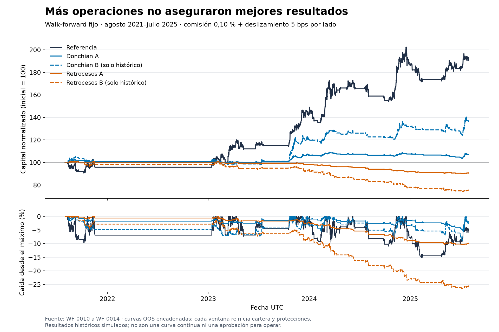

# Comparación de candidatas — 17 de septiembre de 2026

La infraestructura quedó implementada y la referencia fue actualizada en el VPS. **No se activó ninguna candidata**: Retrocesos A falla la validación y Donchian A no alcanza el Sharpe requerido. Donchian B es el resultado nuevo más prometedor, pero permanece exclusivamente histórico, tal como se fijó antes de correr. No se cambiaron parámetros ni se abrió el holdout para rescatar resultados.

## Comparación en el mismo período

Walk-forward fijo de 24 meses IS y 6 meses OOS, ocho ventanas completas. OOS: **2021-08-01 a 2025-08-01 exclusivo**. Todos comienzan con 10.000 USDT simulados; comisión 0,10 % y deslizamiento 5 bps por lado. A usa riesgo por stop 0,25 % / 2 posiciones / exposición máxima 50 %; B usa 0,50 % / 3 posiciones / 75 %.

| Configuración | Retorno neto acumulado | CAGR | Sharpe | PF | Caída máxima | Cierres | Cierres/mes | Registro |
|---|---:|---:|---:|---:|---:|---:|---:|---|
| Referencia | +90.65 % | +17.51 % | 1.04 | 2.68 | 15.28 % | 34 | 0.71 | [WF-0014](../runs/WF-0014-candidates-reference/REPORT.md) |
| Retrocesos A | -9.42 % | -2.44 % | -1.44 | 0.63 | 10.41 % | 529 | 11.02 | [WF-0010](../runs/WF-0010-candidates-pullback_rsi-a/REPORT.md) |
| Retrocesos B | -24.83 % | -6.89 % | -1.56 | 0.60 | 26.51 % | 694 | 14.46 | [WF-0011](../runs/WF-0011-candidates-pullback_rsi-b/REPORT.md) |
| Donchian A | +6.81 % | +1.66 % | 0.61 | 1.40 | 5.11 % | 163 | 3.40 | [WF-0012](../runs/WF-0012-candidates-donchian-a/REPORT.md) |
| Donchian B | +36.29 % | +8.05 % | 1.01 | 1.70 | 8.92 % | 213 | 4.44 | [WF-0013](../runs/WF-0013-candidates-donchian-b/REPORT.md) |

Los cierres/mes incluyen los 48 meses, también los meses sin operaciones. Una operación cerrada incluye compra y venta; las alertas notifican cada fill. El filtro mantuvo a las candidatas sin operaciones durante 2022. La mayor frecuencia no implica actividad todos los días.

| Configuración | Volatilidad anual | Duración media | Comisiones USDT¹ | Tiempo con posición² | Mayor tramo bajo el máximo |
|---|---:|---:|---:|---:|---:|
| Referencia | 16.93 % | 368.8 h | 392.79 | 41.17 % | 438 días |
| Retrocesos A | 1.70 % | 14.5 h | 510.35 | 14.72 % | 1355 días |
| Retrocesos B | 4.51 % | 14.5 h | 1312.67 | 15.64 % | 1413 días |
| Donchian A | 2.78 % | 97.4 h | 142.94 | 26.76 % | 777 días |
| Donchian B | 8.00 % | 100.6 h | 381.93 | 28.06 % | 776 días |

Volatilidad = desviación muestral de retornos diarios UTC × √365, con rf=0, consistente con el Sharpe del motor. ¹ Suma de fees de las ventanas, cada una con 10.000 iniciales; la curva de retorno se encadena. ² Fracción de velas con alguna posición; **no es porcentaje del capital invertido**. El tope por posición reutiliza el sizing existente: 25 % del cash libre ajustado por costos, por lo que suele ser menor al 25 % de equity.

Gráfico reproducible con `python experiments/candidates-2026-09-17/render_comparison.py`. Frecuencia mensual en [monthly_closed_trades.csv](monthly_closed_trades.csv); métricas derivadas en [derived_metrics.json](derived_metrics.json).

## Benchmarks del motor

| Benchmark OOS | Retorno neto acumulado | CAGR | Sharpe | Caída máxima |
|---|---:|---:|---:|---:|
| B&H BTC (OOS) | +175.83 % | +28.87 % | 0.76 | 77.11 % |
| B&H BTC filtrado (OOS) | +214.53 % | +33.17 % | 1.07 | 26.93 % |
| Equiponderado (OOS) | +174.95 % | +28.77 % | 0.72 | 81.53 % |

Los benchmarks llevan sus costos en la curva pero no generan ledger de fills/trades comparable. Usan exposición y presupuestos diferentes: sus retornos absolutos no son una comparación a igual riesgo. El B&H BTC filtrado también supera el Sharpe de Donchian B (1,07 vs 1,01). La referencia conserva sus reglas previas y excepciones de validación documentadas en ADR-0010; su buen OOS no cambia el resultado desfavorable de su holdout EXP-0010 ni la convierte en apta para dinero real.

## Muestra continua

Período **2019-08-01 a 2025-09-01 exclusivo**; no reinicia la cartera cada seis meses. No confundir estos retornos con la evaluación OOS. Agosto de 2025 forma parte del backtest continuo; el WF lo deja fuera porque no completa otra ventana de seis meses.

| Configuración | Retorno neto | CAGR | Sharpe | Caída máxima | Cierres | Registro |
|---|---:|---:|---:|---:|---:|---|
| Referencia | +302.75 % | +25.72 % | 1.17 | 21.44 % | 59 | [EXP-0024](../runs/EXP-0024-candidates-reference/REPORT.md) |
| Retrocesos A | -12.17 % | -2.11 % | -1.24 | 13.22 % | 842 | [EXP-0012](../runs/EXP-0012-candidates-pullback_rsi-a/REPORT.md) |
| Retrocesos B | -30.69 % | -5.85 % | -1.33 | 32.72 % | 1089 | [EXP-0015](../runs/EXP-0015-candidates-pullback_rsi-b/REPORT.md) |
| Donchian A | +21.88 % | +3.30 % | 1.05 | 5.18 % | 254 | [EXP-0018](../runs/EXP-0018-candidates-donchian-a/REPORT.md) |
| Donchian B | +90.63 % | +11.18 % | 1.28 | 8.87 % | 334 | [EXP-0021](../runs/EXP-0021-candidates-donchian-b/REPORT.md) |

## Costos adversos: protocolo sin reajustes

Comisión fija de 0,10 % por lado. Se repitieron tanto backtest continuo como WF fijo, meseta y Monte Carlo con 10 y 20 bps de deslizamiento por lado. Los perfiles y señales permanecieron idénticos.

| Configuración | Slippage/lado | Retorno continuo | Retorno OOS | Sharpe OOS | DD OOS | PF OOS | Registros continuo / WF |
|---|---:|---:|---:|---:|---:|---:|---|
| Retrocesos A | 5 bps | -12.17 % | -9.42 % | -1.44 | 10.41 % | 0.63 | [EXP-0012](../runs/EXP-0012-candidates-pullback_rsi-a/REPORT.md) / [WF-0010](../runs/WF-0010-candidates-pullback_rsi-a/REPORT.md) |
| Retrocesos A | 10 bps | -15.10 % | -11.55 % | -1.78 | 12.25 % | 0.55 | [EXP-0013](../runs/EXP-0013-candidates-pullback_rsi-a-cost-10/REPORT.md) / [WF-0015](../runs/WF-0015-candidates-pullback_rsi-a-cost-10/REPORT.md) |
| Retrocesos A | 20 bps | -21.24 % | -16.14 % | -2.49 | 16.56 % | 0.41 | [EXP-0014](../runs/EXP-0014-candidates-pullback_rsi-a-cost-20/REPORT.md) / [WF-0016](../runs/WF-0016-candidates-pullback_rsi-a-cost-20/REPORT.md) |
| Retrocesos B | 5 bps | -30.69 % | -24.83 % | -1.56 | 26.51 % | 0.60 | [EXP-0015](../runs/EXP-0015-candidates-pullback_rsi-b/REPORT.md) / [WF-0011](../runs/WF-0011-candidates-pullback_rsi-b/REPORT.md) |
| Retrocesos B | 10 bps | -35.33 % | -29.39 % | -1.90 | 30.68 % | 0.52 | [EXP-0016](../runs/EXP-0016-candidates-pullback_rsi-b-cost-10/REPORT.md) / [WF-0017](../runs/WF-0017-candidates-pullback_rsi-b-cost-10/REPORT.md) |
| Retrocesos B | 20 bps | -47.24 % | -38.52 % | -2.62 | 39.18 % | 0.39 | [EXP-0017](../runs/EXP-0017-candidates-pullback_rsi-b-cost-20/REPORT.md) / [WF-0018](../runs/WF-0018-candidates-pullback_rsi-b-cost-20/REPORT.md) |
| Donchian A | 5 bps | +21.88 % | +6.81 % | 0.61 | 5.11 % | 1.40 | [EXP-0018](../runs/EXP-0018-candidates-donchian-a/REPORT.md) / [WF-0012](../runs/WF-0012-candidates-donchian-a/REPORT.md) |
| Donchian A | 10 bps | +20.75 % | +6.12 % | 0.55 | 5.37 % | 1.36 | [EXP-0019](../runs/EXP-0019-candidates-donchian-a-cost-10/REPORT.md) / [WF-0019](../runs/WF-0019-candidates-donchian-a-cost-10/REPORT.md) |
| Donchian A | 20 bps | +17.86 % | +4.78 % | 0.43 | 5.89 % | 1.28 | [EXP-0020](../runs/EXP-0020-candidates-donchian-a-cost-20/REPORT.md) / [WF-0020](../runs/WF-0020-candidates-donchian-a-cost-20/REPORT.md) |
| Donchian B | 5 bps | +90.63 % | +36.29 % | 1.01 | 8.92 % | 1.70 | [EXP-0021](../runs/EXP-0021-candidates-donchian-b/REPORT.md) / [WF-0013](../runs/WF-0013-candidates-donchian-b/REPORT.md) |
| Donchian B | 10 bps | +86.00 % | +34.05 % | 0.95 | 9.23 % | 1.65 | [EXP-0022](../runs/EXP-0022-candidates-donchian-b-cost-10/REPORT.md) / [WF-0021](../runs/WF-0021-candidates-donchian-b-cost-10/REPORT.md) |
| Donchian B | 20 bps | +74.61 % | +28.89 % | 0.83 | 10.41 % | 1.54 | [EXP-0023](../runs/EXP-0023-candidates-donchian-b-cost-20/REPORT.md) / [WF-0022](../runs/WF-0022-candidates-donchian-b-cost-20/REPORT.md) |

## Decisiones con los criterios congelados

- **Retrocesos A**: no aprobado (8 criterios fallan). Meseta: 0 % de 14 variantes; Monte Carlo de 5.000 remuestreos, DD p95 13.28 %.
  Fallan: Sharpe OOS = -1.44; Profit factor OOS = 0.63; Ventanas OOS positivas = 2/8 (25 %); Régimen: retorno 2020 = -2.21 %; Régimen: retorno 2021 = -0.85 %; Régimen: retorno 2023 = -1.71 %; Régimen: retorno 2024 = -6.53 %; Meseta ±20 % = 0.00 %.
- **Retrocesos B**: no aprobado (10 criterios fallan). Meseta: 0 % de 14 variantes; Monte Carlo de 5.000 remuestreos, DD p95 36.33 %.
  Fallan: Sharpe OOS = -1.56; Profit factor OOS = 0.60; Max DD OOS = 26.51 %; Ventanas OOS positivas = 1/8 (12 %); Régimen: retorno 2020 = -5.02 %; Régimen: retorno 2021 = -4.25 %; Régimen: retorno 2023 = -5.14 %; Régimen: retorno 2024 = -16.47 %; Meseta ±20 % = 0.00 %; Monte Carlo DD p95 = 36.33 %.
- **Donchian A**: no aprobado (1 criterios fallan). Meseta: 100 % de 14 variantes; Monte Carlo de 5.000 remuestreos, DD p95 6.07 %.
  Fallan: Sharpe OOS = 0.61.
- **Donchian B**: aprobado (falta el holdout). Meseta: 100 % de 14 variantes; Monte Carlo de 5.000 remuestreos, DD p95 10.67 %.
  Pasa los criterios previos al holdout a 5 bps. Perfil B excluido de paper por el protocolo; Gate 1 completo sigue pendiente. No se reemplaza A por B después de observar resultados.

**Holdout no ejecutado para estas familias.** Ningún perfil A pasó las etapas previas. El período desde 2025-09-01 ya fue observado con otras estrategias; esa exposición previa se conserva explícita y no puede presentarse como un conjunto completamente virgen.

Lectura de la hipótesis: los retrocesos multiplicaron movimientos y costos sin una ventaja neta. Donchian sostuvo beneficios en la muestra completa, pero A perdió fuerza OOS; B cambia tamaño y cantidad de posiciones, por lo que no es simplemente duplicar la misma cartera de A. Los tres presupuestos (referencia, A y B) no tienen igual volatilidad realizada. No se optimizó después de ver estos resultados.

## Reproducibilidad y límites

- Código y configuraciones congelados en `bf0f088`, rama `codex/paper-multiestrategia`; las 26 corridas registran `git_dirty=false`. Python 3.12.4 en la Mac; dependencias instaladas con uv. No se ejecutó investigación pesada en el VPS.
- 13 backtests EXP y 13 WF: candidatas, costos y comparación de referencia. Parámetros fijos, IS 24m/OOS 6m, semilla 42; meseta ±20 % en los tres parámetros definidos para cada familia, sin ajustar valores tras resultados.
- Ocho datasets Binance 4h verificados con `data-check`: ADA/BNB/BTC/ETH/LTC/XRP 14.605 velas cada uno, LINK 14.513, SOL 11.081; cuatro huecos previamente registrados en cada serie salvo SOL, sin huecos. Candidatas: hash `40a0aa8573b9`.
- Activación histórica tras completar warmup: LINK desde 2019-08-06 y SOL desde 2021-03-01; todos los pares están activos en las ocho ventanas OOS. Warmup mínimo 1.212 velas.
- Cada ventana WF reinicia cash, posiciones y protecciones; luego se encadenan retornos. En las corridas base quedan dos posiciones abiertas al cierre de ventanas por cada perfil candidato y cinco en la referencia: se valúan a mercado sin fee de salida, y no entran en PF/Monte Carlo de trades. Ver detalle en cada REPORT y ADR-0008.
- Circuit breaker del 20 % y límite diario del 3 % no garantizan topes de pérdida: pueden continuar salidas y hay reanudación tras pausa. Retrocesos B alcanzó DD mayor al 20 %; no se ocultó ni reajustó el presupuesto.
- La comparación usa el motor y modelo de fills existentes: no simula profundidad de libro, colas ni todos los efectos de ejecución real. La evidencia histórica no sustituye el seguimiento prospectivo.

## Infraestructura y despliegue comprobados

- Pruebas: **598 passed, 4 network deselected**, Ruff y formato en verde, mypy en 172 archivos sin errores; revisión `trading-code-reviewer` **APROBADO** tras resolver atomicidad del outbox, prefijos y overrides de recepción.
- Cobertura específica: entradas/salidas/prioridad, lookahead y equivalencia, reinicio de salida temporal, filtro sin datos, separación de DB/STOP/RESUME, rollback del fill y aviso, recuperación de pendientes y errores/rate limits; dos emisores con un único receptor. Ningún fill artificial se insertó para probar Telegram.
- Referencia actualizada el 2026-09-17 a las 15:29 UTC (12:29 Argentina). Imagen `tradingbot:bf0f088`, ID `sha256:dddf2e5b14745f8286e958c9926343b0b3124d175fa7e9c75e6a1ab2e5589afa`. Imagen anterior conservada como `tradingbot:rollback-bf0f088`, ID `sha256:cb570a21a43786ed05c1488608dad477aa85ce247b98f6b323bc5e23c1241a31`.
- Respaldo consistente SQLite: `/root/tradingbot-backups/rollout-bf0f088-20260917T152854Z/`; integrity check OK. Recuperación ensayada con copia local y exchange falso antes del rollout.
- Tras reiniciar: contenedor saludable, `restored_from_db=true`, cash 5.000,3090623 USDT, posición 0,06320673 BTC a 79.021,51, stop 63.225,11. Conserva 1 fill, 1 posición y 0 trades cerrados. Outbox nuevo vacío (sin avisos retroactivos); DB quick_check OK.
- Telegram: conexión del receptor confirmada en log; prueba `telegram-test --send-only` aceptada, **1 envío, 0 errores, 0 comandos recibidos**. El receptor original siguió siendo el único. Snapshot de recursos: CPU 0,14 %, RAM 281,2 MiB de 3,73 GiB. No equivale a una prueba de carga de tres procesos.
- `/root/trading-bot/compose.override.yaml` fija la nueva imagen para reinicios ordinarios; checkout operativo previo conservado. Artefactos de release en `/root/tradingbot-releases/bf0f088`. Instrucciones de rollback en el runbook.
- Candidatas desactivadas: no se iniciaron contenedores ni saldos prospectivos, y no corresponde afirmar tres papers en funcionamiento. La comparación desde una fecha de inicio común queda aplicable cuando una candidata pase todos los gates; deberá declarar la posición heredada de la referencia y no sumar saldos independientes.
- El snapshot de `status.json` se actualiza al completar ciclos o fills, no al conectar Telegram: inmediatamente después de arrancar puede mostrar `arranque`/`connected=false` aunque el log confirme conexión. El healthcheck tolera el intervalo de velas; no se forzó una operación para refrescarlo.

[Runbook de operación, pausa y recuperación](../../docs/runbooks/paper-multiestrategia.md). La entrega es simulación; no habilita trading real.

La separación de envío/recepción sigue el ciclo `initialize/start/stop/shutdown`; `Application.start()` no inicia la consulta de actualizaciones por sí mismo. Referencia: [python-telegram-bot 22, Application.start](https://docs.python-telegram-bot.org/en/v22.0/telegram.ext.application.html#telegram.ext.Application.start).
