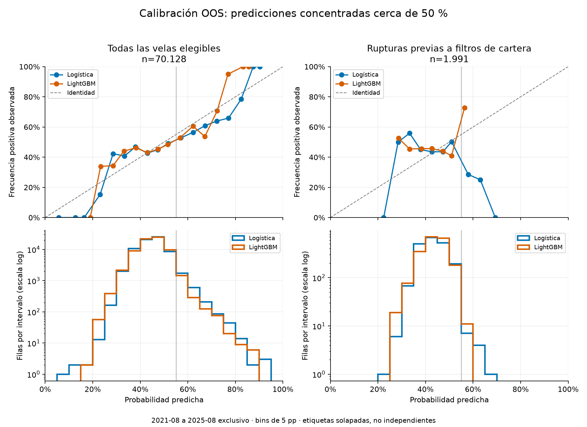

# Investigación Supertrend, ML y observador LLM — 2026-09-17

**Decisión: conservar la referencia paper y no activar candidatas nuevas.**
Supertrend v1 no supera los criterios históricos. Los filtros ML v1 prácticamente
eliminan las entradas y no aportan una mejora frente a Donchian. El observador LLM
está implementado y probado sin red; no se eligió modelo ni se inició una cohorte.
No hay evidencia de rentabilidad de un LLM y no se habilitó ejecución con IA.

Código en `codex/research-ml-llm`, commits locales autorizados, sin merge ni push.
No se modificó el VPS, su cuenta paper, sus posiciones ni Telegram en esta etapa.
El historial y los avisos de la referencia conservan la implementación anterior.

## Protocolo y trazabilidad

- [Plan aprobado](../../docs/strategy/plan-siguiente-etapa-2026-09-17.md),
  [Supertrend v1](../../docs/strategy/supertrend-v1.md),
  [ML v1](../../docs/strategy/ml-filter-v1.md),
  [observador](../../docs/strategy/advisor-v1.md),
  [ADR-0014](../../docs/decisions/ADR-0014-research-predicciones-y-estado.md).
- Ocho variantes nuevas: Supertrend 4h/1h A/B y Donchian+Logística/LightGBM 4h A/B.
  Ocho backtests continuos, 24 walk-forwards nuevos y seis controles de reproducción:
  **38 corridas financieras**, todas finalizadas correctamente y registradas por CLI.
  Además, cinco registros de dataset/modelos/predicciones y cuatro comparaciones
  estadísticas emparejadas. Todos sin holdout, sobre revisiones limpias.
- Supertrend: `d4576bd`, EXP-0025…0028 y WF-0023…0034. ML y controles: `af1b65f`,
  EXP-0029…0032, WF-0035…0052 y RES-0001…0009. Observador final: `715f3b0`.
- Walk-forward fijo de 24 meses de entrenamiento y seis de evaluación: ocho ventanas,
  **48 meses OOS, 2021-08-01 a 2025-08-01 exclusivo**. El mes restante hasta septiembre
  no forma una ventana completa. No confundir estos retornos acumulados con anuales.
- Universo fijo de ocho pares contra USDT, activación según disponibilidad y warmup;
  incluye sesgo por selección retrospectiva del universo. Binance Spot long-only.
- A: 0,25 % de riesgo objetivo por stop, dos posiciones y exposición de entrada 50 %.
  B: 0,50 %, tres y 75 %, exclusivamente histórico. Tope por posición: 25 % del cash
  ajustado por costos, no del equity. Capital inicial por simulación: 10.000 USDT.
- Fee 0,10 % y slippage 5/10/20 bps por lado. Límite diario 3 %, breaker 20 % y pausa
  de 30 días. No garantizan una caída máxima de cuenta de esos valores.
- Meseta ±20 % y Monte Carlo de 5.000 muestras en cada WF. Ningún parámetro fue
  cambiado para rescatar una variante después de ver su resultado.
- Datos locales 1h/4h verificados. Historia adicional 4h desde 2017 para ML, separada
  de la usada por los controles. Veintidós intervalos de huecos de 2018 se contrastaron
  con klines públicas; faltan 52 barras entre pares. No se inventaron velas.

Comandos y salidas están en [batch.jsonl](batch.jsonl), [ml-batch.jsonl](ml-batch.jsonl),
[models.jsonl](models.jsonl) y [comparisons.jsonl](comparisons.jsonl). Las rutas
absolutas reflejan esta Mac; el [runbook](../../docs/runbooks/research-ml-llm.md)
explica cómo reproducir desde la raíz. Cada corrida conserva configuración y hashes.

## Supertrend: más operaciones en 1h, peor resultado

Resultados OOS con 5 bps por lado:

| Variante | WF | Retorno neto | DD máximo | Sharpe | PF | Cierres/mes | Meses con cierres |
|---|---|---:|---:|---:|---:|---:|---:|
| Supertrend 4h A | 0023 | +6,53 % | 2,70 % | 0,67 | 1,50 | 2,85 | 29/48 |
| Supertrend 4h B | 0026 | +5,68 % | 7,37 % | 0,27 | 1,16 | 3,90 | 29/48 |
| Supertrend 1h A | 0029 | −6,08 % | 10,79 % | −0,33 | 0,92 | 11,50 | 32/48 |
| Supertrend 1h B | 0032 | −26,44 % | 30,92 % | −0,72 | 0,82 | 15,54 | 32/48 |

4h A falla el umbral de Sharpe ≥0,8 y el benchmark BTC (0,76). 4h B falla también
PF, ventanas positivas y retorno de 2024. En 1h A fallan seis criterios; en 1h B,
ocho, incluido el DD y Monte Carlo. Todas quedan **no-go**.

| Variante | Retorno a 5 / 10 / 20 bps | Meseta aprobada a 5 / 20 bps | DD Monte Carlo p95 a 5 / 20 bps |
|---|---|---|---|
| S4 A | +6,53 / +5,91 / +4,70 % | 14/14 / 10/14 | 4,12 / 4,91 % |
| S4 B | +5,68 / +4,07 / +0,94 % | 14/14 / 9/14 | 14,08 / 17,18 % |
| S1 A | −6,08 / −10,67 / −19,16 % | 5/14 / 0/14 | 20,63 / 34,16 % |
| S1 B | −26,44 / −34,53 / −46,65 % | 2/14 / 0/14 | 54,81 / 83,07 % |

La mayor actividad no compensó los costos. La duración media cae de unas 96–98 horas
en 4h a unas 24 horas en 1h. Se mantienen períodos expresados en velas, de modo que
también cambia el horizonte económico: no es un experimento de frecuencia pura.
Los resultados positivos de la muestra continua no sustituyen el fallo OOS.

## ML: no mejora incremental y muestra insuficiente

Receta congelada: 21 variables, objetivo de retorno neto positivo a 24 horas,
entrenamiento mensual con ventanas calendario de 21 meses para ajuste y tres para calibración, purga temporal
y aceptación `p >= 0,55`. El objetivo no es la ganancia final de un trade Donchian.
La predicción solo veta compras; no modifica tamaños, ranking, stops ni salidas.

| Variante | WF | Retorno OOS | DD | Sharpe | PF | Cierres | Meses con cierres |
|---|---|---:|---:|---:|---:|---:|---:|
| Donchian A, control | 0047 | +6,806 % | 5,112 % | 0,605 | 1,401 | 163 | 30/48 |
| Logística A | 0035 | +0,294 % | 0,459 % | 0,206 | 2,650 | 3 | 2/48 |
| LightGBM A | 0041 | −0,009 % | 0,382 % | −0,009 | 0,971 | 3 | 1/48 |
| Donchian B, control | 0050 | +36,285 % | 8,919 % | 1,008 | 1,701 | 213 | 30/48 |
| Logística B | 0038 | +0,087 % | 1,077 % | 0,033 | 1,105 | 4 | 2/48 |
| LightGBM B | 0044 | −0,698 % | 1,256 % | −0,275 | 0,354 | 5 | 1/48 |

El DD bajo acompaña a pasar casi todo el período en cash. Tres cierres y PF 2,65
no constituyen evidencia de una ventaja. Logística A retiene solo 4,3 % del retorno
de su control, lejos del 90 % previsto para la hipótesis secundaria de reducción
de DD. No se selecciona esta métrica después de fallar la primaria.

Comparación registrada, retornos diarios emparejados, bootstrap por bloques de
30 días, 5.000 muestras, semilla 42. Criterio primario: ΔSharpe ≥0,10, DD no más de
dos puntos peor y límite inferior del IC95 % positivo.

| Candidata vs. su control | Registro | ΔSharpe | IC95 % | Criterio incremental |
|---|---|---:|---|---|
| Logística A | RES-0006 | −0,399 | [−1,458; +0,726] | Falla |
| Logística B | RES-0007 | −0,974 | [−2,105; +0,202] | Falla |
| LightGBM A | RES-0008 | −0,614 | [−1,616; +0,512] | Falla |
| LightGBM B | RES-0009 | −1,283 | [−2,309; −0,012] | Falla |

Los intervalos describen incertidumbre histórica bajo este bootstrap, no eliminan
sesgo de investigación ni cambios de régimen. Con tan pocos trades, no sostienen
una selección de modelo. A 20 bps/lado, retornos LR A/B +0,239/−0,040 %, LightGBM
A/B −0,045/−0,819 %, controles A/B +4,775/+28,891 %. Ninguna mejora al subir costos.

### Cobertura y calibración

Se construyeron 86.260 filas etiquetadas y **55 modelos mensuales por familia**.
Dieciocho cortes anteriores no pudieron entrenarse: uno por historia insuficiente
y 17 por muestras insuficientes. El primer modelo es
de febrero de 2021; la primera etiqueta válida es de septiembre de 2020. La SMA
diaria de 200 días completos invalida ventanas que contienen huecos reales, aunque
existan precios más antiguos. El primer modelo no dispone de 21 meses completos de
filas válidas: su ajuste usa las disponibles desde septiembre de 2020. La cobertura
es incompleta entre agosto de 2019 y enero de 2021, incluidos 2020 y parte de 2021,
requeridos por GATES; Gate 1 se registra **incompleto**, no aprobado.

El OOS de agosto de 2021 a agosto de 2025 sí tiene **70.128 predicciones válidas por
familia**. Los pocos trades se explican por el veto del modelo, no por falta de
predicciones en ese OOS. De 1.991 filas con ruptura antes de filtros de cartera,
Logística acepta 12 (0,60 %) y LightGBM 11 (0,55 %). Las once de LightGBM se concentran
en noviembre de 2021 y no son once episodios temporales independientes.

| Muestra OOS | Brier Logística / LightGBM | Log-loss Logística / LightGBM |
|---|---|---|
| Todas las filas | 0,248889 / 0,248808 | 0,691048 / 0,690867 |
| Filas de ruptura | 0,251504 / 0,250793 | 0,696549 / 0,695033 |

Un predictor constante `p=0,5` tiene Brier 0,25. La pequeña mejora global desaparece
en las rupturas que interesan a Donchian. Los bins extremos tienen pocas filas y
las etiquetas se solapan. No interpretar una frecuencia extrema como calibración
probada. Conteos exactos: [calibration-bins.csv](calibration-bins.csv).

La meseta de 24 variantes (canales, ATR y umbral) solo alcanza 41,7 % en LR y 58,3 %
en LightGBM a costo base, contra 80 % exigido. Monte Carlo se ejecutó, pero 3–5
trades y cobertura incompleta impiden usarlo como certificación de riesgo.

**ML v1: inconcluso/no promovible.** No se abrió holdout ni se bajó el umbral.
No se ejecutaron variantes adicionales de semillas, ventanas, reducción de variables
ni el control con exposición reducida estimada en entrenamiento. Se detiene esa
inversión, permitida por el orden de entregas del plan, porque falla el criterio
primario y la muestra es insuficiente. Esos componentes no se dan por validados;
serían requisito de un futuro protocolo de promoción. No se atribuye el menor DD
a habilidad predictiva.

## Actividad, costos y comparación con la referencia

| Variante, 5 bps | Volatilidad anualizada | Duración media | Tiempo con posición | Fees acumuladas USDT |
|---|---:|---:|---:|---:|
| S4 A / B | 2,41 / 5,75 % | 98,4 / 95,4 h | 23,89 / 24,88 % | 127,70 / 347,91 |
| S1 A / B | 4,49 / 9,97 % | 24,1 / 24,4 h | 22,89 / 23,90 % | 1.005,15 / 2.278,63 |
| LR A / B | 0,36 / 0,73 % | 118,7 / 94,0 h | 0,95 / 0,95 % | 3,69 / 9,58 |
| LightGBM A / B | 0,24 / 0,63 % | 104,0 / 91,2 h | 0,54 / 0,54 % | 2,39 / 8,05 |
| Donchian A / B | 2,78 / 8,00 % | 97,4 / 100,6 h | 26,76 / 28,06 % | 142,94 / 381,93 |

Tiempo con posición significa fracción de velas con alguna posición, no porcentaje
medio del capital invertido. Fees y trades suman ventanas que reinician cartera;
la curva OOS encadena sus retornos. No equivalen a un único paper sin reinicios.
La volatilidad usa retornos diarios y anualización √365. Todas las métricas/costos
están en [oos-summary.csv](oos-summary.csv), reproducible con [summarize.py](summarize.py).

La referencia previamente evaluada obtuvo +90,65 %, DD 15,28 %, Sharpe 1,04 y 0,71
cierres/mes en estos 48 meses OOS. Conserva un holdout pendiente/desfavorable y
no queda aprobada para dinero real. Los presupuestos de exposición son diferentes;
no es una comparación a igual riesgo. [Resultados anteriores](../candidates-2026-09-17/REPORT.md).

Benchmarks de los WF 4h: B&H BTC +175,83 %, DD 77,11 %, Sharpe 0,76; BTC filtrado
+214,53 %, DD 26,93 %, Sharpe 1,07; equiponderado +174,95 %, DD 81,53 %, Sharpe 0,72.
Los reportes individuales incluyen benchmarks de cada intervalo. Sus campos
agregados de fees/exposición tienen las limitaciones ya registradas en ROADMAP;
no usar el 100 % de exposición impreso del benchmark filtrado como medición real.

Los seis controles sin IA tienen `trades.csv` y `equity.csv` **idénticos byte a byte**
a los anteriores: WF-0047…0052 corresponden a WF-0012/0019/0020/0013/0021/0022.
La infraestructura opt-in no cambió el resultado sin IA a ninguno de los tres costos.

## Implementación y comprobaciones

- Supertrend comparte motor y recurrencia exacta; checkpoint atómico recuperable,
  paridad de ventana y serie completa, recuperación de pares y protección ante
  checkpoint ausente. Stops y salidas continúan aunque no se permitan compras.
- ML usa variables causales compartidas, purga, scaler/calibración solo con pasado,
  pesos JSON y hashes de dataset/modelo/predicción, cobertura temporal explícita,
  replay histórico e inferencia local con publicación/vencimiento.
- Observador entry/exit separado del broker: BUY/SELL/HOLD/ABSTAIN y motivo categórico,
  acción compatible con posición, identidad/hash, cola acotada, deadline de 45s,
  presupuesto atómico, fallas/429, conservación de respuestas truncadas y recuperación
  sin repetir llamadas inciertas. Fuente de posiciones solo lectura y exclusivamente paper.
- CLI `advisor contract` prueba tres casos sintéticos, guarda tokens/costo/latencia
  y aplica reglas de selección sin PnL. Adaptador Anthropic probado con SDK simulado;
  no se hizo una llamada real ni se generó gasto. No se ha elegido proveedor/modelo.
- **635 tests locales y cuatro de red pública pasaron (639 en total). Ruff, formato y mypy limpios.**
  Revisión técnica aprobada para motor/estrategia/ML y observador tras corregir hallazgos.
  Docker ML `tradingbot-research:715f3b0` construido en la Mac; smoke sin red, CLI y carga de sklearn/LightGBM.
  Compose validado sin desplegar. No es una prueba operativa del VPS x86.
  [Registro de verificación e imagen](verification.json).

## Próxima etapa condicionada

1. Mantener la referencia paper y archivar estas candidatas sin promoverlas.
2. Si se desea invertir en observación LLM, fijar como máximo dos modelos/versiones
   y tarifas y ejecutar el contrato sintético; elegir por validez, costo y latencia.
   Luego iniciar una cohorte prospectiva separada. La infraestructura ya está preparada;
   todavía no está corriendo un agente que decida sobre el mercado.
3. El replay actual audita decisiones, **no calcula rentabilidad**. Antes de un paper
   LLM faltan ejecución diferida común, datos 1m, fills posteriores a decisión y a
   señal+60s, expiración a 120s, stops cronológicos y control con la misma espera.
4. Solo una base A elegible y evidencia prospectiva de ≥12 semanas/40 cierres por
   cartera, con mejora incremental y costos de API, permitirían evaluar su promoción.
   No se reemplaza ese período por consultas retrospectivas ni operaciones artificiales.

No se inició observación ni se desplegaron candidatas porque ninguna base nueva es
elegible y no hay modelo/API elegidos. La observación sin órdenes puede empezar sin
aprobar una estrategia, pero no constituye aprobación financiera. La combinación
opcional ML+LLM tampoco se habilitó con estos modelos rechazados.
